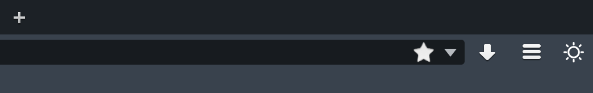
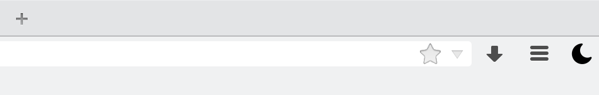

# Nitefox

Toggle between light and dark variants of the FF Developer Edition Theme.


# Screenshots
In the dark theme:


In the light theme:



# Installation

Download it from
[addons.mozilla.org](https://addons.mozilla.org/en-US/firefox/addon/nitefox/)


# Building

```bash
$ git clone https://github.com/vise890/nitefox
$ cd ./nitefox
$ cfx xpi
```

... And drag the generated `nitefox.xpi` into your add-ons view.


# Testing

```bash
$ cfx test
```


# Acknowledgements

- Moon icon made by [Freepik](http://www.freepik.com) from
  [www.flaticon.com](http://www.flaticon.com) is licensed under [CC BY
  3.0](http://creativecommons.org/licenses/by/3.0/)
- Sun icon made by [Rami McMin](http://RamiMcM.in) from
  [www.flaticon.com](http://wwwh.flaticon.com) is licensed under [CC BY
  3.0](http://creativecommons.org/licenses/by/3.0/)
